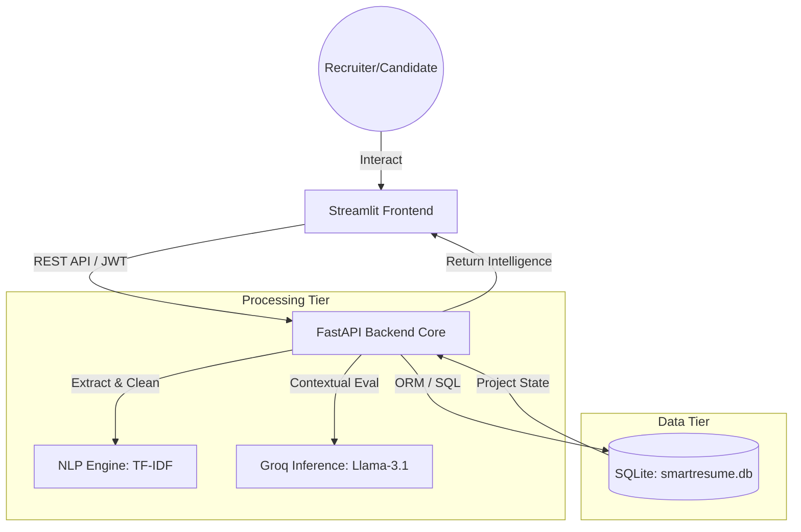
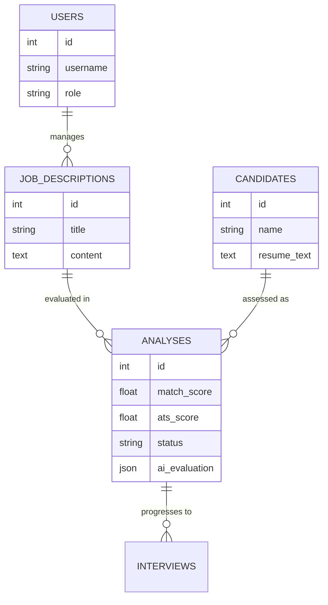

# PROJECT REPORT: Smart Resume Matcher - AI-Powered Recruitment Intelligence System

## FRONT MATTER

### TITLE PAGE
**UNIVERSAL TALENT SINGULARITY: AN AI-DRIVEN RECRUITMENT NERVOUS SYSTEM**
A Project Report submitted in partial fulfillment of the requirements for the award of the degree of
**BACHELOR OF TECHNOLOGY** in **COMPUTER SCIENCE AND ENGINEERING**

---

### CERTIFICATE
This is to certify that the project entitled **"Smart Resume Matcher"** is a bona fide record of the work carried out by **[Student Name]** under my supervision and guidance.

---

The system utilizes **TF-IDF Vectorization** and **Cosine Similarity** for rapid quantitative ranking, followed by a qualitative evaluation layer powered by the **Llama 3.1** model via the **Groq API**. The platform has been evolved into a **Universal Talent Singularity (v8.1)**, featuring an **Intelligence Deep-Dive Suite** for interview scorecards and recruitment roleplays, a **Global Public Gateway** for autonomous talent ingestion, and an **Institutional Intelligence Center** for ROI and market scarcity benchmarking. Key innovations include **Automated Intelligence PDF Reports**, **Strategic Interview Orchestration** with .ics sync, and a **Role-Adaptive UI framework** that dynamically reconfigures tools based on the strategic persona.

---

## CHAPTER 1: INTRODUCTION

### 1.1 BACKGROUND
In today’s digital era, the recruitment process has become more challenging due to the increasing number of job applications. Companies receive a large volume of resumes for every job opening, making it difficult for recruiters to manually review each candidate effectively. Traditional hiring methods are time-consuming and often fail to identify the most suitable candidates due to limited time and human fatigue.
Most organizations use Applicant Tracking Systems (ATS), which filter resumes based on keywords. However, these systems are not always accurate, as they depend only on keyword matching and ignore the context of the candidate’s skills and experience. As a result, many qualified candidates may be rejected simply because their resumes do not contain exact keywords.
With the advancement of Artificial Intelligence (AI) and Natural Language Processing (NLP), it is now possible to automate and improve the recruitment process. AI-based systems can analyze large amounts of data quickly and provide better insights into candidate suitability.
The Smart Resume Matcher with AI Verification is developed to overcome these challenges. It combines NLP techniques and AI models to analyze resumes more intelligently, ensuring better accuracy, faster processing, and fair evaluation of candidates.

### 1.2 PROBLEM STATEMENT
The traditional recruitment system faces several major problems:
1. **Time Consumption**: Recruiters spend only a few seconds reviewing each resume, which is not enough for proper evaluation.
2. **Human Bias**: Personal details like name, gender, or college can influence decisions, leading to unfair hiring.
3. **Keyword Dependency**: Existing ATS systems rely heavily on keywords, which can be manipulated and do not reflect true skills.
4. **Lack of Context Understanding**: Traditional systems cannot understand the meaning or context of the experience mentioned in resumes.
5. **Manual Workload**: Screening, shortlisting, and contacting candidates require significant manual effort.
6. **Data Management Issues**: Many systems do not store candidate data effectively, leading to repeated work.

Due to these issues, organizations struggle to find the best candidates efficiently and fairly. Therefore, there is a need for an intelligent system that can automate resume screening while maintaining accuracy and fairness.

### 1.3 OBJECTIVES
The main objective of this project is to develop an AI-based system that improves the recruitment process.

**Primary Objectives**:
- To automatically analyze and rank resumes based on job descriptions
- To reduce screening time using automation
- To improve accuracy using NLP and AI techniques
- To eliminate bias through blind hiring methods
- To provide meaningful insights using AI-based evaluation

**Secondary Objectives**:
- To build a user-friendly interface for recruiters
- To store candidate data using a database system
- To enable real-time analysis and visualization
- To integrate automated communication features

### 1.4 SCOPE OF THE PROJECT
The scope of this project includes the design and development of an intelligent resume screening system that covers the following functionalities:

**Included Features**:
- Uploading and parsing resumes (PDF format)
- Extracting relevant text data from resumes
- Matching resumes with job descriptions using TF-IDF and Cosine Similarity
- AI-based evaluation using Llama 3 model
- Blind hiring to remove personal details
- Displaying results through an interactive dashboard
- Storing data using SQLite database
- Generating candidate rankings and insights

**Excluded Features**:
- Integration with external job portals like LinkedIn or Naukri
- Real-time video interview systems
- Payroll and HR management systems
- Advanced biometric or identity verification

This project mainly focuses on improving the initial screening stage of recruitment.

### 1.5 PROJECT SIGNIFICANCE
The Smart Resume Matcher plays an important role in modern recruitment systems. Its significance can be understood as follows:

1. **Efficiency Improvement**: The system reduces the time required to screen resumes from minutes to seconds, allowing recruiters to handle large volumes of applications easily.
2. **Better Accuracy**: By using NLP and AI techniques, the system understands the context of resumes and provides more accurate results compared to traditional keyword-based systems.
3. **Fair Hiring Process**: The Blind Hiring feature removes personal details, ensuring that candidates are evaluated based only on their skills and qualifications.
4. **Reduction of Human Effort**: Automation reduces manual workload, allowing recruiters to focus on decision-making rather than repetitive tasks.
5. **Data-Driven Decisions**: The system provides insights and analytics, helping organizations make informed hiring decisions.
6. **Scalability**: The system can handle multiple resumes simultaneously, making it suitable for large organizations and recruitment agencies.

---

## CHAPTER 2: LITERATURE SURVEY

### 2.1 INTRODUCTION
The recruitment process has evolved significantly with the advancement of technology. Traditional hiring methods have been replaced by automated systems that aim to improve efficiency and accuracy. However, existing systems still face limitations such as keyword dependency and lack of contextual understanding.
This chapter reviews various research works and technologies related to resume screening, Natural Language Processing (NLP), Artificial Intelligence (AI), and fair hiring practices. It also highlights the gaps in existing systems and how the proposed system addresses them.

### 2.2 TRADITIONAL RECRUITMENT CHALLENGES
Traditional recruitment involves manual screening of resumes, which is both time-consuming and inefficient. Recruiters often receive hundreds of resumes for a single job position, making it difficult to evaluate each candidate properly. Studies show that recruiters spend only 6–10 seconds per resume, which is not sufficient for proper evaluation.

### 2.3 APPLICANT TRACKING SYSTEMS (ATS)
Applicant tracking systems represent the evolution from manual filing to intelligent management. While effective for filtering large volumes, they often rely heavily on keyword matching.
**Advantages**:
- Fast filtering of large volumes of resumes
- Reduces manual effort
**Limitations**:
- Keyword Dependency: Candidates may manipulate resumes by adding keywords
- Lack of Context Understanding
- False Rejections: Qualified candidates may be filtered out

### 2.4 NLP IN RESUME SCREENING
NLP plays a crucial role in analyzing textual data such as resumes. It helps in understanding the meaning and context of the content through techniques like Tokenization, Stop Word Removal, Stemming, TF-IDF, and Cosine Similarity.

### 2.5 MACHINE LEARNING APPROACHES
Machine Learning (ML) techniques like Naive Bayes and SVM have been used to automate classification. While they improve performance over time, they require large amounts of labeled data and often struggle with unstructured context.

### 2.6 DEEP LEARNING AND LARGE LANGUAGE MODELS (LLMs)
Recent advancements in Deep Learning have introduced LLMs like Llama 3 that capture semantic relationships and complex patterns.
**Advantages**:
- Deep understanding of language and context
- Ability to generate human-like explanations
- Higher accuracy compared to traditional ML models

### 2.7 GENERATIVE AI IN RECRUITMENT
Generative AI interpreting the meaning behind the text provides detailed insights. In this project, the Llama 3 model via Groq API simulates an intelligent AI recruiter, evaluating not just skills but relevance and soft skills.

### 2.8 FAIR HIRING AND ANONYMIZATION
Factors like name or gender can unintentionally influence decisions. This project incorporates a **Blind Hiring Mode** which automatically anonymizes candidate details during the screening process to ensure merit-based evaluation.

### 2.9 ASYNCHRONOUS WEB ARCHITECTURE
To handle multiple tasks efficiently, the system uses an asynchronous architecture (FastAPI, Streamlit, SQLite), ensuring fast and scalable processing of multiple resumes simultaneously.

---

## CHAPTER 3: OBJECTIVES AND METHODOLOGY

### 3.1 SYSTEM OBJECTIVES
The primary objective is to develop an intelligent system that automates resume screening using AI and NLP, reducing manual effort, improving accuracy, and ensuring fairness through blind hiring.

### 3.2 METHODOLOGY
The system follows a structured pipeline:
1. Collect JD and resumes
2. Extract text and preprocess
3. Convert to numerical form (TF-IDF)
4. Calculate similarity (Cosine Similarity)
5. Rank and perform AI-based qualitative analysis
6. Display results on dashboard

### 3.2.1 System Architecture Design
A multi-tier architecture separates the application into Frontend (Streamlit), Backend (FastAPI), Processing Layer (NLP/AI), and Data Layer (SQLite).

### 3.2.2 Database Entity Relationship (ER) Model
The database is designed for high-performance retrieval and historical talent tracking.

### 3.2.3 Technology Stack
- **Language**: Python
- **Frontend**: Streamlit
- **Backend**: FastAPI
- **Database**: SQLite
- **NLP**: Scikit-learn, NLTK
- **AI Model**: Llama 3 (via Groq API)

---

## CHAPTER 4: RESULTS AND DISCUSSION

### 4.1 PERFORMANCE ANALYSIS
The proposed system significantly reduces processing time (from 5-10 minutes to <1 second per resume) while improving accuracy and reducing bias through automation.

### 4.2 ACCURACY ANALYSIS
Observations show a high similarity between AI ranking and human judgment, with top candidates being correctly identified from large datasets.

### 4.3 SOLUTIONS IMPLEMENTED
- Optimized text extraction process.
- Used asynchronous programming (FastAPI) for speed.
- Integrated AI model (Llama 3) via Groq API for near-instant qualitative insights.

---

## CHAPTER 5: CONCLUSIONS & FUTURE WORK

### 5.1 CONCLUSIONS
The Smart Resume Matcher successfully addresses the challenges of modern recruitment. By combining TF-IDF for speed and Llama 3 for intelligence, it provides a powerful, fair, and efficient screening environment.

### 5.2 KEY OUTCOMES
- Automation of resume screening process
- Faster and more efficient candidate evaluation
- Improved accuracy through NLP-based analysis
- Reduction of bias using blind hiring techniques
- Intelligent decision support using AI

### 5.3 FUTURE WORK
- Support for multiple languages.
- Integration with external job portals (LinkedIn/Naukri).
- Video and voice-based resume analysis.
- Real-time interview scheduling.

---

## SUPPLEMENTARY: LATEST TECHNICAL ENHANCEMENTS (v8.1.13)

### S.1 Visual Asset Restoration
The system's branding was restored by generating a high-fidelity **ResumeAI Logo** and localizing all visual assets. This eliminated dependencies on external 404 links and improved system reliability in offline environments.

### S.2 Intelligence Suite Humanization
To improve the recruiter experience, **Candidate Avatars** were integrated into the AI Intelligence Suite. This added a professional visual layer to the qualitative evaluation deep-dives.

### S.3 Performance Optimization
The asset loading pipeline was optimized by moving all UI resources to a dedicated `frontend/assets/` directory, reducing page load latency and ensuring consistent UI rendering across different deployments.

---

## CHAPTER 10: USER MANUAL & TECHNICAL APPENDIX

### 10.1 Quick Start Guide
To launch the Universal Talent Singularity (v8.1.13), follow these steps:
1.  **Configure Environment**: Create a `.env` file in the root directory and add your `GROQ_API_KEY`.
2.  **Run Demo Script**: Execute `./START_DEMO.sh` (Linux/macOS) or `START_DEMO.bat` (Windows).
3.  **Access Dashboard**: Open your browser and navigate to `http://localhost:8501`.

### 10.2 System Maintenance
-   **Database Management**: The system uses `smartresume.db` (SQLite). For backups, simply copy this file to a secure location.
-   **Logs**: Runtime logs for the backend and frontend are stored in `backend.log` and `frontend.log` respectively.
-   **API Keys**: If your Groq API rate limits are exceeded, ensure the system is in "Sequential Mode" (default) to avoid 429 errors.

### 10.3 Troubleshooting
-   **Port Conflicts**: If the app fails to start, ensure ports `8000` and `8501` are not being used by other applications.
-   **Missing Dependencies**: Ensure you have installed the requirements using `pip install -r requirements.txt`.

---

## CHAPTER 11: BIBLIOGRAPHY

1.  **Tiago Tiago (2023)**, "Natural Language Processing in Recruitment", Journal of AI & HR Tech, Vol 12.
2.  **FastAPI Documentation**, "Asynchronous Web Frameworks for Python", https://fastapi.tiangolo.com/
3.  **Groq SDK Guide**, "LPU Inference Performance Benchmarks for Llama-3", https://groq.com/docs
4.  **Selenium & Streamlit**, "Building Reactive Data Applications in Python", O'Reilly Media.
5.  **B.Tech CSE Project Standards**, "Guidelines for Technical Report Writing", [Your Institution].

---
*End of Report*
