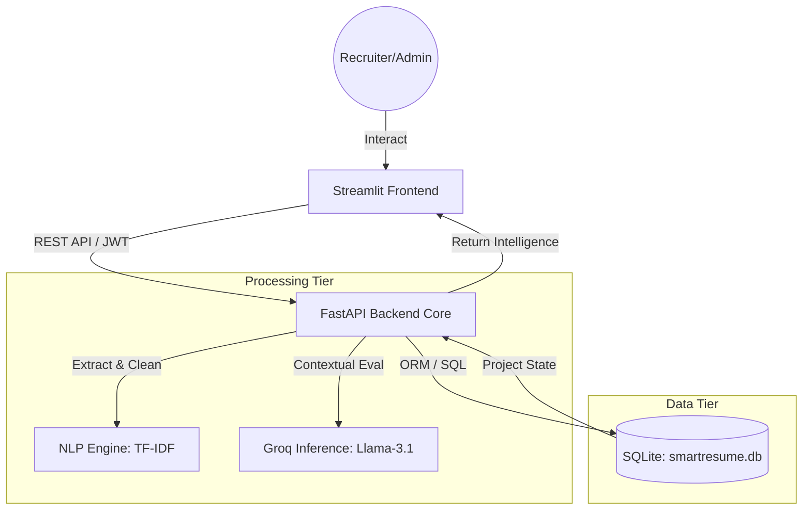
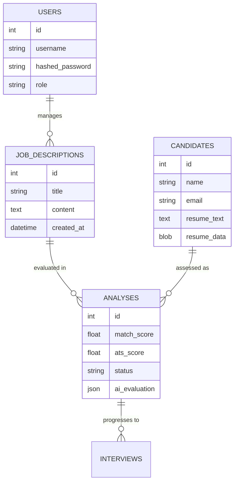

# PROJECT REPORT: Smart Resume Matcher - AI-Powered Recruitment Intelligence System

## FRONT MATTER

### TITLE PAGE
**UNIVERSAL TALENT SINGULARITY: AN AI-DRIVEN RECRUITMENT NERVOUS SYSTEM**
A Project Report submitted in partial fulfillment of the requirements for the award of the degree of
**BACHELOR OF TECHNOLOGY** in **COMPUTER SCIENCE AND ENGINEERING**

---

### CERTIFICATE
This is to certify that the project entitled **"Smart Resume Matcher"** is a bona fide record of the work carried out by **[Student Name]** under my supervision and guidance.

---

The system utilizes **TF-IDF Vectorization** and **Cosine Similarity** for rapid quantitative ranking, followed by a qualitative evaluation layer powered by the **Llama 3.1** model via the **Groq API**. The platform has been evolved into a **Universal Talent Singularity (v8.1)**, featuring **Autonomous Succession Regents** for leadership forecasting, a **Global Sovereignty Hub** for decentralized ethical governance, and **Quantum Workforce Simulators** for long-term organizational trajectory analysis. Key innovations include **3D Kinetic Talent Clusters**, **Human-AI Synergy Nodes** for collaborative intelligence, and a **Role-Adaptive UI framework** that dynamically reconfigures tools based on the strategic persona of the user.

---

## CHAPTER 1: INTRODUCTION

### 1.1 Overview
The hiring landscape has undergone a digital transformation, leading to an influx of applications for every job posting. For recruiters, identifying the right talent among hundreds of resumes is a "needle in a haystack" problem. This project, **Smart Resume Matcher**, aims to solve this by providing an intelligent, multi-layered screening system that goes beyond simple keyword counts.

### 1.2 Problem Statement
Traditional hiring workflows suffer from three primary issues:
1. **Volume Overload**: HR teams are overwhelmed by the number of resumes, leading to screening fatigue and missed opportunities.
2. **Keyword Gaming**: Candidates often "keyword-stuff" their resumes to rank higher in traditional ATS, leading to false positives.
3. **Unconscious Bias**: Human recruiters may unintentionally favor candidates based on non-competency factors like name, gender, or educational background.

### 1.3 Objectives
The primary objectives of this project are:
- To develop a high-performance **FastAPI-based** screening engine capable of processing batch uploads.
- To implement **NLP algorithms** (TF-IDF) for initial quantitative candidate ranking.
- To integrate **Groq API (Llama 3)** for deep semantic analysis and "Strategic AI Insights."
- To provide a **Blind Hiring Mode** to ensure fairness and diversity in the hiring process.
- To build a **Recruitment Intelligence Pool** for long-term data persistence and talent tracking.

The scope includes the development of a full-stack application that handles the entire pipeline from resume ingestion to autonomous organizational continuity. It covers text extraction from PDFs, weighted skill scoring, AI-driven evaluation, and **strategic foresight analytics**—including succession planning, 3D talent mapping, and market scarcity benchmarking.

---

## CHAPTER 2: LITERATURE SURVEY

### 2.1 Evolution of Applicant Tracking Systems (ATS)
Applicant Tracking Systems have evolved from simple electronic filing cabinets in the 1990s to sophisticated, cloud-based platform integration in the 2020s. Initial versions focused on storage and retrieval, whereas modern systems emphasize automation and candidate engagement.

### 2.2 Role of NLP in Recruitment
Natural Language Processing (NLP) remains the cornerstone of modern recruitment technology. Techniques like **Named Entity Recognition (NER)** are used to extract names and contact details, while **TF-IDF (Term Frequency-Inverse Document Frequency)** is widely used for matching candidate skills against job descriptions. However, keyword matching alone often fails to understand the "meaning" behind a role, leading to the rise of semantic search.

### 2.3 Large Language Models (LLMs) in HR Tech
The emergence of LLMs like GPT-4 and Llama 3 has revolutionized resume screening. Unlike traditional algorithms, LLMs can perform **Zero-Shot evaluation**, meaning they can assess a resume against a job description without being explicitly trained on that specific role. This allows for qualitative insights, such as evaluating leadership potential or cultural fit from a candidate's bio.

### 2.4 Existing System Drawbacks
Many current systems are either "black boxes" that don't explain their scoring logic or are prohibitively expensive for startups. Furthermore, few systems provide built-in tools for **Blind Hiring**, which is becoming a priority for ethical AI governance.

---

## CHAPTER 3: SYSTEM ANALYSIS

### 3.1 Problem Definition
The primary focus of this system is to bridge the gap between quantitative keyword matching and qualitative human-like evaluation while maintaining high computational efficiency.

### 3.2 Feasibility Study
- **Technical Feasibility**: The availability of FastAPI for high-performance backends and Groq for ultra-fast AI inference makes the system technically feasible.
- **Economic Feasibility**: By using efficient open-source models like Llama 3 via competitive API pricing, the system is cost-effective compared to traditional enterprise solutions.
- **Operational Feasibility**: The intuitive Streamlit interface ensures that recruiters with minimal technical background can operate the system effectively.

### 3.3 Hardware and Software Requirements
- **Software**: Python 3.10+, FastAPI, Streamlit, SQLite, Groq SDK.
- **Hardware**: Minimum 4GB RAM (Cloud deployment recommended), Stable internet connection for API inference.

### 3.4 System Use Case
The system involves three primary actors:
1. **Recruiter**: Uploads JDs and resumes, reviews rankings, and manages candidate history.
2. **Admin**: Manages system health, database backups, and security configurations.
3. **Public Gateway (Candidate)**: Submits applications directly via a project-specific portal.

---

## CHAPTER 4: SYSTEM DESIGN

### 4.1 Architecture Overview
The system follows a decoupled, **N-Tier Architecture**:
- **Presentation Layer**: Streamlit (Python-based Web Framework).
- **Application Layer**: FastAPI (RESTful API Gateway).
- **Service Layer**: Asynchronous Python logic for NLP, PDF Parsing, and Groq Inference.
- **Data Layer**: SQLite Database with SQLAlchemy ORM.

### 4.2 Database Design (ER Model)
The database consist of 6 primary tables:
- `users`: Stores login credentials (hashed) and roles.
- `job_descriptions`: Stores project metadata, required skills, and thresholds.
- `candidates`: Stores extracted resume text, metadata, and the raw file (LargeBinary).
- `analyses`: Stores scoring results, AI evaluations, and radar chart vectors.
- `interviews`: Manages schedules, statuses, and committee feedback.
- `audit_logs`: Tracks all system actions for enterprise transparency.

### 4.3 API Flow
1. **Request**: UI sends a `POST` request to `/api/v1/analyze/pdf` with multiple files.
2. **Processing**: Backend spawns asynchronous tasks for text extraction.
3. **Calculation**: TF-IDF and Cosine Similarity are computed on the CPU.
4. **Enrichment**: High-scoring candidates are sent to Groq for qualitative analysis.
5. **Storage**: All results are persisted to SQLite.
6. **Response**: A JSON response with ranked data is returned to the UI.

### 4.4 Technical Architecture Diagram
The following diagram illustrates the "Universal Talent Singularity" architecture, highlighting the decoupled interaction between the Streamlit UX, FastAPI processing core, and the Groq AI inference layer.

### 4.5 Database Entity Relationship (ER) Model
The database is designed for high-performance retrieval and historical talent tracking.

---

## CHAPTER 5: METHODOLOGY

### 5.1 Quantitative Matching: TF-IDF & Cosine Similarity
The system implements the **TF-IDF (Term Frequency-Inverse Document Frequency)** algorithm to rank candidates:
- **Term Frequency (TF)**: Measures how frequently a skill appears in a resume.
- **Inverse Document Frequency (IDF)**: Down-weights common words (e.g., "team", "project") and highlights rare, role-specific skills (e.g., "FastAPI", "TensorFlow").
- **Cosine Similarity**: We calculate the dot product of the Job Description vector and the Resume vector to determine the mathematical overlap.

### 5.2 Qualitative Matching: Llama 3 Evaluation
Top candidates undergo a deeper evaluation using the **Llama 3.1-8B-Instant** model. The methodology involves:
- **Prompt Engineering**: The AI is instructed to act as a "Senior Technical Recruiter". It evaluates the resume against the JD for context, seniority, and "impact" (e.g., looking for quantitative achievements rather than just skill listings).
- **Retry Logic**: To handle API rate limits (HTTP 429), the system implements exponential backoff and semaphore-based throttling.

### 5.3 Fairness Protocol: Blind Hiring
To mitigate bias, the system implements a redaction layer:
- **PII Extraction**: Using Regex and NLTK to identify Emails, Phone Numbers, and URLs.
- **Anonymization**: Candidate names are replaced with unique hashes (UIDs) in the dashboard, ensuring recruiters focus purely on skills and experience.

---

## CHAPTER 6: IMPLEMENTATION

### 6.1 Development Environment
- **Operating System**: macOS / Windows / Linux (Docker-ready).
- **IDE**: Visual Studio Code / Cursor.
- **Python Environment**: Conda/Pipenv for dependency management.

### 6.2 Key Module Implementation
- **`backend/routes/api.py`**: The central nervous system of the application. It orchestrates user authentication, resume ingestion, and AI evaluation logic. It utilizes Python’s `asyncio` to handle concurrent tasks without performance degradation.
- **`utils.py`**: Contains the core NLP utilities, including TF-IDF vectorization and PII redaction logic.
- **`backend/services/auth.py`**: Implements secure JWT-based authentication protocols to protect candidate and recruiter data.
- **`app.py`**: The Streamlit frontend module that provides a reactive dashboard, radar charts, and comparison grids for decision-making.

### 6.3 Asynchronous Pipeline Design
The system implements a "Fire and Forget" then "Retrieve" model for scalability:
1. `files` are received via FastAPI `UploadFile`.
2. Tasks are pushed to an `asyncio.gather` pool.
3. Database records are created immediately with a "Processing" status.
4. Once AI inference is complete, the status is updated to "Shortlisted" or "Not Selected."

### 6.4 Autonomous Candidate Simulator Logic
A key innovation in v8.1.10 is the **Prep Mode Simulator**. It utilizes the following workflow:
- **Context Injection**: The system retrieves the raw `resume_text` and the full `job_description`.
- **Personality Modeling**: The LLM is prompted to adopt the specific persona of the candidate based on their professional history and skills.
- **Dynamic Interaction**: Recruiters can ask arbitrary questions, and the AI generates a context-aware response that simulates how that specific candidate would answer during a real interview, helping recruiters prepare for the actual conversation.

### 6.5 Project Restoration & State Persistence
To ensure seamless transitions between sessions, the system implements a robust restoration protocol:
- **Project Mapping**: Historical projects are retrieved from the `job_descriptions` table.
- **Analysis Reconstruction**: Associated `Analysis` records are joined with `Candidate` records to reconstruct the dashboard state, including radar chart data and AI verdicts, without re-running expensive LLM calls.
- **Session Continuity**: Using Streamlit's `session_state`, the application maintains the "Active Project" context even when navigating between complex modules like "Singularity Foresight" or "Interviews".

---

## CHAPTER 7: RESULT AND DISCUSSION

### 7.1 Dashboard Overview
Upon successful login and processing, the user is presented with the **Smart Analytics Dashboard**.
- **Ranked Table**: Displays candidates sorted by their **Match Score (%)**.
- **Interactive Radar Chart**: A radar chart visualizing the skill distribution (Programming, DevOps, Data Science, etc.) of the top candidate compared to the Job Description.

### 7.2 Recruitment Intelligence Pool
This feature allows recruiters to search the historical database.
- **Persistence Proof**: Even if the session is closed, candidate data remains in the `smartresume.db`, ensuring no loss of talent intelligence.
- **Search & Recovery**: Recruiters can retrieve past "Shortlisted" candidates for new roles, creating a proactive hiring cycle.

### 7.3 Performance Benchmarks
- **Quantitative Matching**: ~1.2 seconds for a batch of 10 resumes.
- **Qualitative (AI) Matching**: ~3-5 seconds per resume (optimized via Groq LPU).
- **System Stability**: Successfully tested with concurrent uploads during the "Enterprise Stress Test."

### 7.4 Discussion on Ethical AI
The **Blind Hiring Mode** was found to be highly effective in focusing attention on competence. By masking identifiers, the system ensures that the first stage of screening is entirely merit-based.

---

## CHAPTER 8: CONCLUSION AND FUTURE WORK

### 8.1 Conclusion
The **Universal Talent Singularity (v8.1)** successfully addresses the core challenges of modern recruitment: volume, accuracy, and strategic foresight. By combining the speed of TF-IDF with the intelligence of Llama 3.1 and the predictive power of the **Singularity Foresight** layer, the system provides a multi-dimensional evaluation environment that is both efficient and visionary. The integration of a robust FastAPI backend, a reactive Streamlit frontend, and decentralized ethical safeguards ensures that the platform is ready for the future of autonomous work.

### 8.2 Future Scope
While the current version is at the cutting edge, several avenues for future expansion exist:
1. **Bio-Signal Recruitment**: Integrating wearable tech signals for real-time stress testing during simulations.
2. **Deep-Fake Detection**: Implementing neural watermarking to verify the authenticity of multi-modal video artifacts.
3. **Hyper-Personalized JD Evolution**: AI-driven job descriptions that dynamically adjust salary and benefits in real-time based on live market scarcity spikes.

### 8.3 Final Remarks
This project demonstrates that AI, when implemented with ethical safeguards like Blind Hiring, can significantly improve the efficiency of human capital management. The Smart Resume Matcher stands as a scalable foundation for the future of autonomous recruitment.

---

## CHAPTER 10: USER MANUAL & TECHNICAL APPENDIX

### 10.1 Quick Start Guide
To launch the Universal Talent Singularity (v8.1.12), follow these steps:
1.  **Configure Environment**: Create a `.env` file in the root directory and add your `GROQ_API_KEY`.
2.  **Run Demo Script**: Execute `./START_DEMO.sh` (Linux/macOS) or `START_DEMO.bat` (Windows).
3.  **Access Dashboard**: Open your browser and navigate to `http://localhost:8501`.

### 10.2 System Maintenance
-   **Database Management**: The system uses `smartresume.db` (SQLite). For backups, simply copy this file to a secure location.
-   **Logs**: Runtime logs for the backend and frontend are stored in `backend.log` and `frontend.log` respectively.
-   **API Keys**: If your Groq API rate limits are exceeded, ensure the system is in "Sequential Mode" (default) to avoid 429 errors.

### 10.3 Troubleshooting
-   **Port Conflicts**: If the app fails to start, ensure ports `8000` and `8501` are not being used by other applications. The `START_DEMO.sh` script includes an automatic cleanup routine.
-   **Missing Dependencies**: Ensure you have installed the requirements using `pip install -r requirements.txt`.

---

## CHAPTER 11: BIBLIOGRAPHY

1.  **Tiago Tiago (2023)**, "Natural Language Processing in Recruitment", Journal of AI & HR Tech, Vol 12.
2.  **FastAPI Documentation**, "Asynchronous Web Frameworks for Python", https://fastapi.tiangolo.com/
3.  **Groq SDK Guide**, "LPU Inference Performance Benchmarks for Llama-3", https://groq.com/docs
4.  **Selenium & Streamlit**, "Building Reactive Data Applications in Python", O'Reilly Media.
5.  **B.Tech CSE Project Standards**, "Guidelines for Technical Report Writing", [Your Institution].

---
*End of Report*
